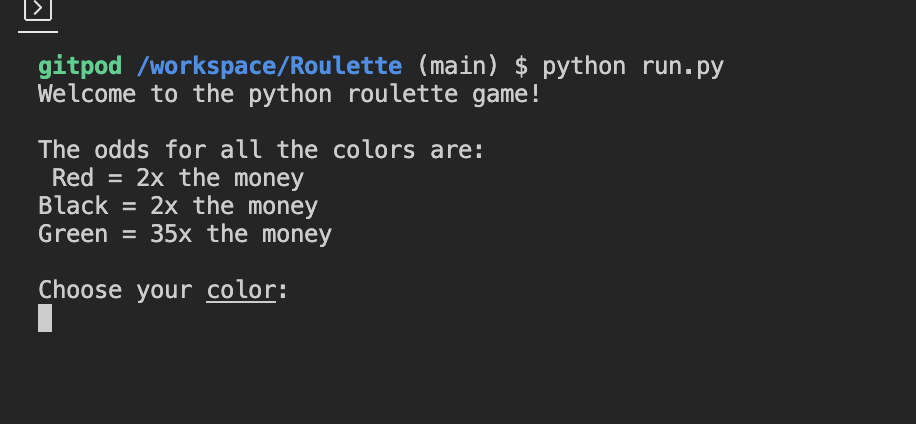
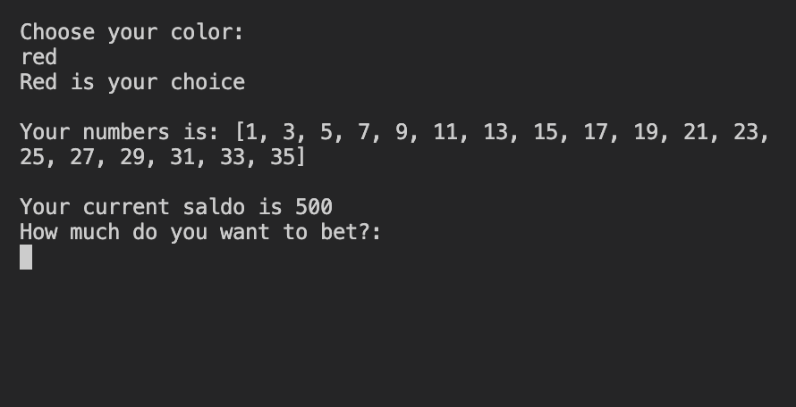
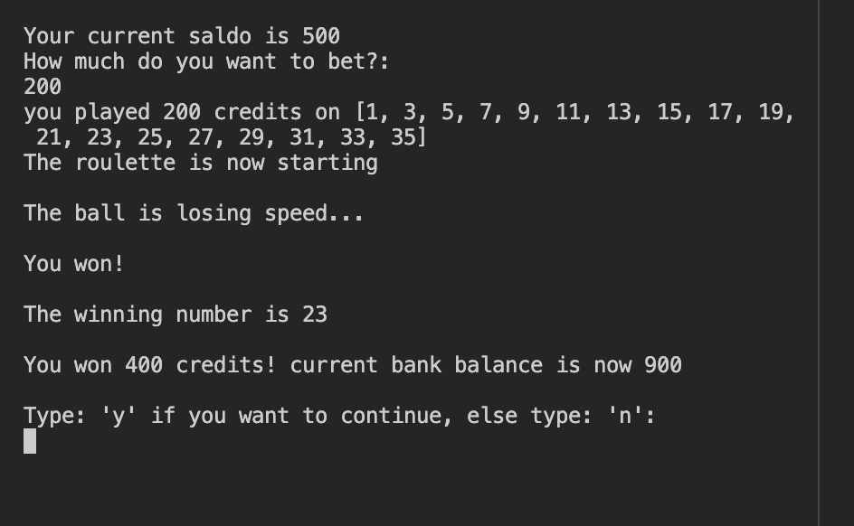

# The Python Roulette Game

## The roulette game
The main purpose with the code/game was to make an easy to play game with interactions such as placing bets and the choice of color. The game is based of the original roulette found inside casinos and maintains the original structure with red as odd, black as even and green as 0.

## This is how the deployd version looks like

place for image when deployd.

## How to play the game

The game offers the player few but crucial choises.
- Pick the color that you want to play
 - The different colors offer different odds
- place your bet
- start the roulette machine
- if you have money left in the bank, play again or stop by typing y/n

## The starting interface

when starting the game this is what you will se
- chose your color between red, black and green
- The input will give an error message if the input is something else

## Place your stake

This is what the user will se when proceding after the color chose
- place a bet that is smaller then what you have in your bank
- if the user try to type in more than what the user have in the bank they will get an error
- the red and black gives you doubble your money and green gives you 35 times the money

## The final display

the final page
- In the final page the user can chose to continue or end the game
- if the user is out of money the game ends automaticly
- the end page will display the amount of money that is won or the money thats been loss

